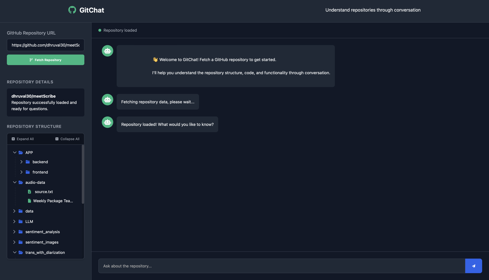
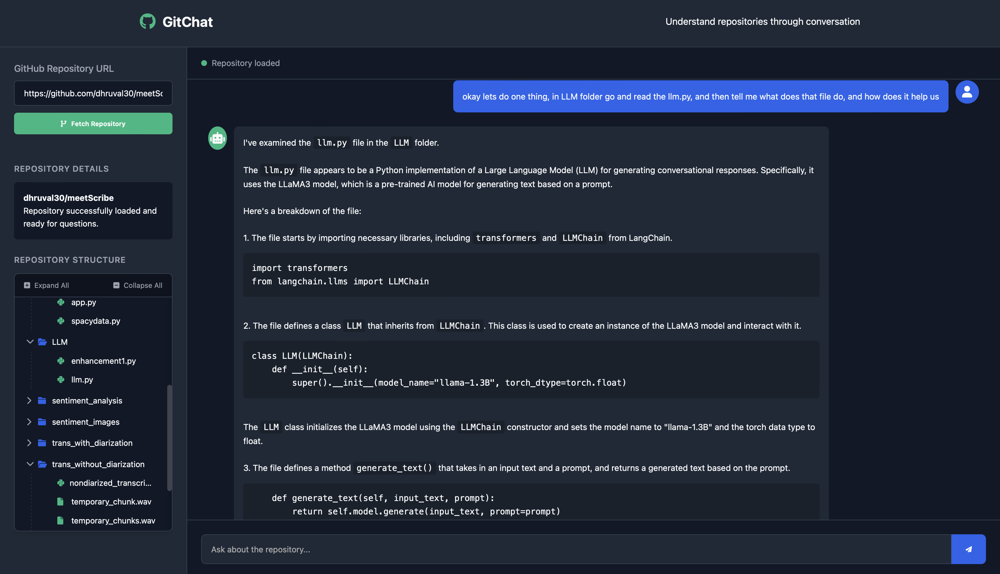

# GitChat

Paste a GitHub repo URL, and GitChat lets you explore the project and ask questions about the codebase in natural language. You can browse the directory structure, preview files, and have contextual conversations.

---

**Live:** [https://gitgitchat.netlify.app](https://gitgitchat.netlify.app)
Large repos might take their time. This thing’s powered by 0.1 CPU and 512MB RAM

## Demo

[▶ Watch Demo Video](demo/demo.mov)

---

## How I Built It

- Used GitHub’s API to crawl repo contents and flatten everything into `FILE: path` chunks.
- Built a regex-based preview system that fetches exact files on demand.
- Used LangChain with `llama3-8b-8192` model for blazing-fast, context-aware Q&A.
- Created a compression mechanism to prioritize README + structure and trim file contents for token limits.
- Repo structure is rendered as an interactive tree in vanilla JS — no React, no frameworks.
- Hit Python's recursion depth on large repos; fixed it by capping traversal and tracking visited paths.
- Backend does all the work — the frontend serves the purpose for now but still needs fixing.

## Deployment 

- Backend is hosted on Render
- Frontend is deployed via Netlify, pulling in the Render backend URL for API calls.

> Everything’s live, connected, and free-tier. Feels good.
